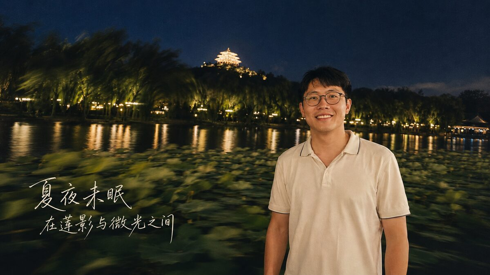
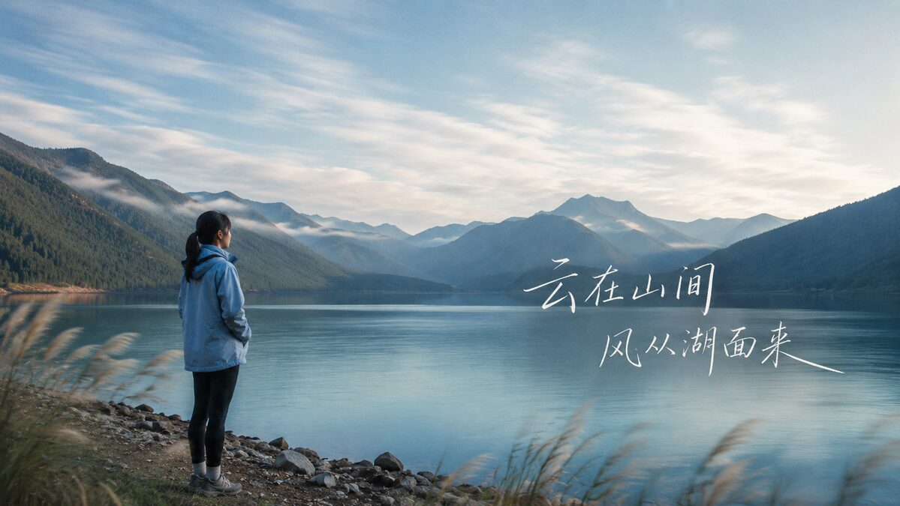
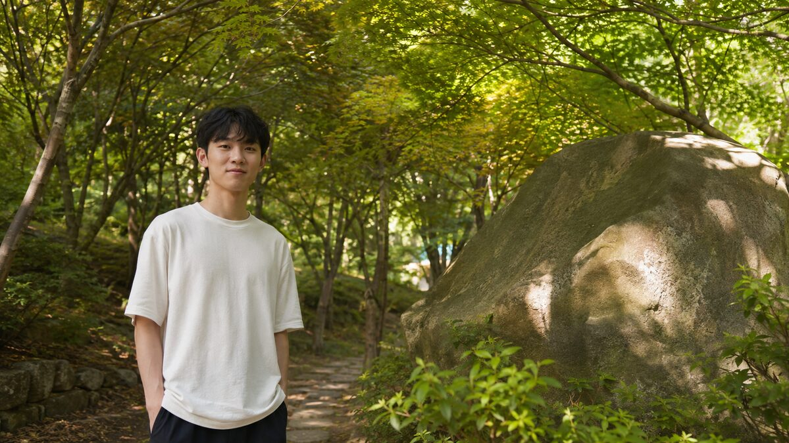
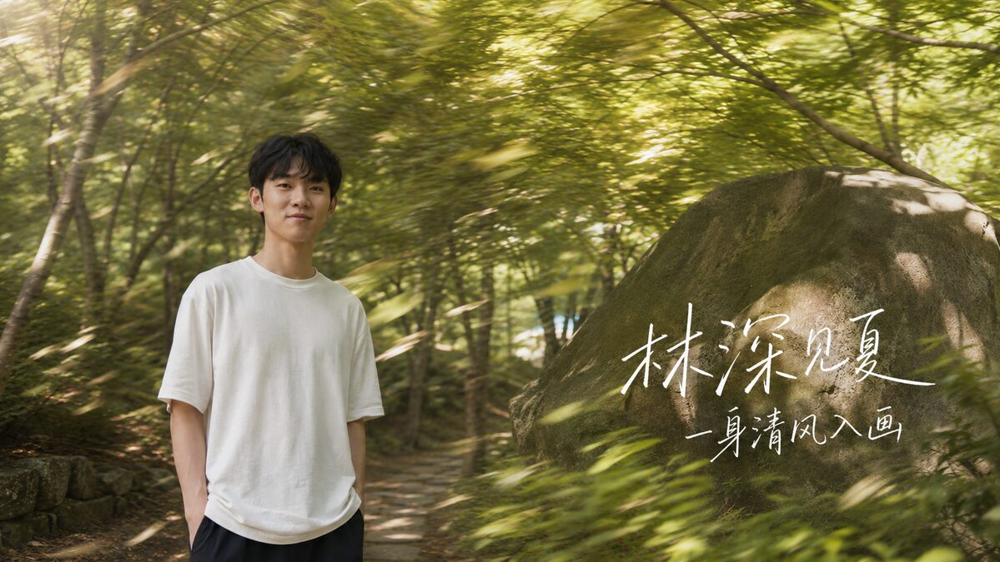

# chinese-motion-photo-poster

中文诗意慢门海报技能 / Chinese poetic motion-photo poster skill

将普通的人像、旅行照和户外快照，转化为横版、摄影写实、带中国气质的诗意慢门海报：保留人物或主体的真实身份，用有物理依据的树影、叶片、水面和光线拖影制造动感，再用大而清晰、细线且有飞白的中文手写题字建立海报层级。

Turn casual portraits, travel photos, and outdoor snapshots into horizontal, photographic Chinese poetic motion posters. The workflow preserves the identity of the main subject, adds physically motivated slow-shutter motion to foliage, water, or light, and finishes with large, legible, fine-line handwritten Chinese typography.

## 技能介绍 / What it does

- 默认输出 16:9 横版单张海报，不添加手机界面、社交平台 UI 或水印。
- 保留脸部、眼镜、发型、服装、身体比例、关键物件和场景透视。
- 用近景掠影、中景拖影和远景光线流动组成三层动感；主体保持清晰。
- 通过墨绿、竹青、黛蓝、米白、暖金、留白和题字建立克制的当代中国风。
- 文字保持细线、自然压力变化、飞白和长笔锋；“更明显”优先通过字号、留白、亮度和局部对比实现，而不是简单加粗。
- 支持针对“太细、太粗、太小、不明显、字体风格不变”等反馈进行单变量迭代。

- Default output: one 16:9 horizontal poster, without phone screenshots, social UI, or watermarks.
- Preserve the face, glasses, hairstyle, clothing, body proportions, key objects, and scene perspective.
- Build motion in three depth layers: foreground sweep, midground drag, and background light or color flow, while keeping the semantic subject sharp.
- Create a restrained contemporary Chinese mood through ink green, jade, muted blue, warm cream, negative space, and calligraphic text.
- Keep typography fine, airy, pressure-sensitive, and dry-brushed. Improve visibility with scale, spacing, brightness, and local contrast—not by turning the strokes into heavy blocks.
- Iterate on one variable at a time when the user asks for changes such as “too thin,” “too heavy,” “too small,” or “keep the same type style.”

## 安装方式 / Installation

### Codex / ChatGPT

1. 下载或克隆本仓库：

   ```bash
   git clone https://github.com/er7635888/chinese-motion-photo-poster.git
   ```

2. 将仓库目录放入 Codex 技能目录，并确保 `SKILL.md` 位于技能根目录：

   ```bash
   cp -R chinese-motion-photo-poster ~/.codex/skills/chinese-motion-photo-poster
   ```

3. 在支持技能的环境中使用：

   ```text
   Use $chinese-motion-photo-poster to turn this photo into a horizontal Chinese poetic motion poster.
   ```

1. Clone the repository:

   ```bash
   git clone https://github.com/er7635888/chinese-motion-photo-poster.git
   ```

2. Copy the repository into your Codex skills directory. The skill root must contain `SKILL.md`:

   ```bash
   cp -R chinese-motion-photo-poster ~/.codex/skills/chinese-motion-photo-poster
   ```

3. Invoke it in a skill-enabled environment:

   ```text
   Use $chinese-motion-photo-poster to turn this photo into a horizontal Chinese poetic motion poster.
   ```

### 直接阅读提示词 / Prompt-only use

如果你的环境不支持自动加载技能，也可以直接阅读 [`SKILL.md`](SKILL.md)，将其中的构图、慢门、文案和迭代规则复制到图像生成提示词中。

If your environment does not auto-load skills, read [`SKILL.md`](SKILL.md) and copy its composition, motion, typography, and iteration rules into your image-generation prompt.

## 基本用法 / Basic usage

准备一张照片，并明确以下信息：

1. 想保留的主体和关键细节；
2. 文案原文（如有，逐字提供）；
3. 横版比例、文字位置和期望氛围；
4. 文字是否需要更大、更明显，或需要保持参考图中的细笔触。

Provide a source photo and specify:

1. The subject and identity details that must be preserved;
2. The exact copy, if any;
3. The desired horizontal layout, text placement, and mood;
4. Whether the text should be larger or more visible while keeping a fine reference-matched stroke weight.

示例 / Example:

```text
使用 chinese-motion-photo-poster，把这张旅行照做成 16:9 横版中国风慢门海报。
保留人物脸部、眼镜、衣服和场景；文案为“云在山间 / 风从湖面来”。
文字要占画面比例高一些，保持参考图中的细线手写风格，不要加粗。
```

## 生成流程 / Workflow

```text
source photo
    ↓
semantic hero + identity preservation
    ↓
foreground / midground / background motion
    ↓
fine handwritten Chinese copy
    ↓
single-variable typography iteration
    ↓
16:9 poster QA
```

工作流会先识别照片中的语义主体，再为环境建立方向明确的慢门关系。最后检查主体保真、文案逐字准确、字重、字号、可读性和画面比例。

The workflow first identifies the semantic hero, then builds directional slow-shutter relationships in the environment. The final QA checks identity preservation, exact copy, stroke weight, scale, readability, and aspect ratio.

## 虚构案例 / Fictional case studies

以下六张图均为虚构示例，仅用于展示技能的输入与输出关系。每组左侧为原图，右侧为处理后的海报。

The six images below are fictional examples created for documentation. In each pair, the left image is the source photograph and the right image is the processed poster.

### 1. 夏夜莲池 / Lotus pond at night

文案 / Copy: `夏夜未眠` · `在莲影与微光之间`

| 原图 / Original | 处理后 / Processed |
| --- | --- |
|  |  |

保留人物、莲池和远处亭阁，用柳影、莲叶和水面反光制造夜景慢门层次。

The person, lotus pond, and distant pavilion remain recognizable while willow shadows, lotus leaves, and reflected lights create the night-motion layers.

### 2. 山间水库 / Mountain reservoir

文案 / Copy: `云在山间` · `风从湖面来`

| 原图 / Original | 处理后 / Processed |
| --- | --- |
|  |  |

保留人物背影、湖岸和山脊，在前景芦苇、湖面和云带中加入轻微的水平动势。

The figure, shoreline, and mountain ridge remain intact while reeds, water, and cloud bands gain a restrained horizontal sense of motion.

### 3. 林深见夏 / Summer in the grove

文案 / Copy: `林深见夏` · `一身清风入画`

| 原图 / Original | 处理后 / Processed |
| --- | --- |
|  |  |

保留人物、圆石和林间路径，只让前景叶片、中景树影和阳光方向产生风吹般的拖影。

The subject, rounded stone, and forest path stay sharp while foreground leaves, midground branches, and sunlight acquire a wind-driven directional drag.

## 设计约束 / Design constraints

- 不使用整张图均匀高斯模糊；运动必须有风、慢门、景深或镜头扩散等视觉原因。
- 不自动添加龙、凤、灯笼、古装、祥云、仙鹤、霓虹粒子等俗套中国符号。
- 不遮挡脸、手、服装标志、石刻、招牌或其他语义关键区域。
- 不擅自改写、增删或补充用户提供的中文文案。
- 参考图控制笔触语言；用户的字号、位置、颜色和可读性要求控制版式。

- Do not apply uniform Gaussian blur; motion should have a visual cause such as wind, shutter drag, depth of field, or optical diffusion.
- Do not add cliché Chinese symbols such as dragons, phoenixes, lanterns, costumes, auspicious clouds, cranes, or neon particles.
- Keep faces, hands, clothing marks, inscriptions, signs, and other semantic areas unobstructed.
- Do not rewrite, add, or remove user-provided Chinese copy.
- Let the reference control stroke language, while the user's size, placement, color, and readability requirements control the layout.

## 文件结构 / Repository layout

```text
.
├── SKILL.md
├── agents/openai.yaml
├── assets/icon.svg
├── examples/
│   ├── case-01-lotus-night/
│   ├── case-02-mountain-lake/
│   └── case-03-maple-grove/
└── README.md
```

## 许可与示例说明 / License and examples

示例图片为本项目文档用的虚构生成素材，不代表真实人物、地点或事件。使用本技能生成的内容时，请自行确认素材来源、肖像权、商标和发布平台规则。

The example images are fictional generated assets made for this documentation; they do not depict real people, places, or events. When using this skill, verify image sources, likeness rights, trademarks, and platform rules for your own project.
